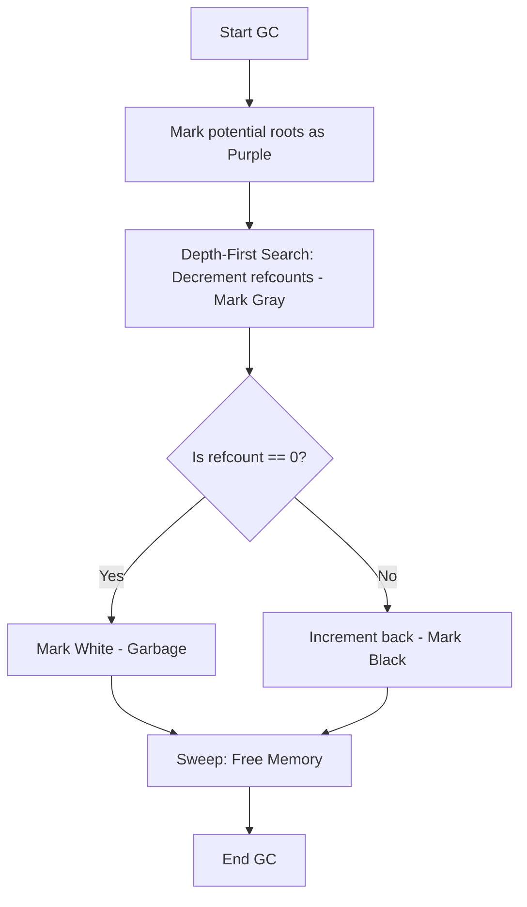

# PHP Garbage Collection

PHP uses an automated memory management system. It primarily relies on **Reference Counting** for immediate memory reclamation and a **Cycle Collector** to handle circular references.

## 1. Reference Counting Basics

In PHP, every variable is stored in a structure called a `zval`.

- **Simple Types (PHP 7+):** Types like `null`, `bool`, `int`, and `float` are stored directly in the `zval` and do not use reference counting.
- **Complex Types:** `string`, `array`, `object`, `resource`, and `reference` use a reference counter (`refcount`).

### How it works:

- When a variable is created or assigned to another variable, the `refcount` of the underlying data increases.
- When a variable goes out of scope or is `unset()`, the `refcount` decreases.
- If the `refcount` reaches **zero**, PHP immediately frees the memory.

```php
$a = ["hello"]; // refcount = 1
$b = $a;        // refcount = 2
unset($a);      // refcount = 1
unset($b);      // refcount = 0 -> Memory freed
```

---

## 2. Collecting Cycles (Circular References)

Reference counting alone cannot handle circular references, where two or more objects point to each other.

```php
$a = new stdClass();
$b = new stdClass();
$a->child = $b;
$b->parent = $a;

unset($a, $b);
```

In this example, even after `unset()`, both objects still have a `refcount` of 1 because they point to each other. This would cause a memory leak if not for the Cycle Collector.

### The Cycle Collection Algorithm (Bacon-Rajan)

PHP uses a concurrent cycle collection algorithm that runs when a "root buffer" of potential cycles reaches a certain limit (default: 10,000).

1. **Root Buffer:** When a `refcount` is decreased but remains > 0, PHP suspects a cycle and adds the `zval` to the root buffer.
2. **Marking (Gray):** The GC performs a depth-first search starting from the roots, decrementing the `refcount` of every internal `zval` it finds.
3. **Scanning (White/Black):**
   - If a `zval`'s `refcount` is now **0**, it is marked as **garbage (white)**.
   - If the `refcount` is **> 0**, it is marked as **reachable (black)** and its `refcount` is restored.
4. **Sweeping:** All "white" `zvals` are deleted from memory.

### Scheme: GC Cycle Collection



---

## 3. Performance Considerations

### CPU vs. Memory

- **GC Enabled (Default):** Prevents memory leaks but introduces periodic CPU overhead when the collection cycle runs.
- **GC Disabled:** Slightly faster execution (useful for very short-lived scripts) but can lead to high memory usage if circular references exist.

### Manual Control

You can control the garbage collector using these functions:

- `gc_enable()` / `gc_disable()`: Turn the collector on or off.
- `gc_collect_cycles()`: Manually trigger a collection cycle.
- `gc_status()`: Returns statistics about the current state of the GC.

### Optimizations in Modern PHP

- **PHP 7.3+:** Significantly improved the performance of the cycle collector.
- **PHP 8.0+:** Better handling of internal structures.
- **PHP 8.3+:** Added the ability to configure the maximum number of roots via `zend.gc_max_roots` and enhanced `gc_status()` output (adding `running`, `protected`, `full` flags).

### Best Practices

- For **long-running processes** (daemons, workers), always keep GC enabled.
- Avoid creating deep circular structures if performance is critical.
- Use `gc_mem_caches()` (PHP 7+) to free up memory used by the Zend Engine memory manager.

---

## Links for Further Reading

- [Reference Counting Basics](https://www.php.net/manual/en/features.gc.refcounting-basics.php)
- [Collecting Cycles](https://www.php.net/manual/en/features.gc.collecting-cycles.php)
- [Performance Considerations](https://www.php.net/manual/en/features.gc.performance-considerations.php)
