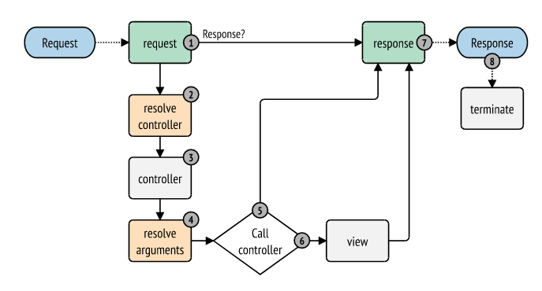

# Symfony Advanced Concepts

## Symfony Kernel Events Lifecycle

The `HttpKernel` component dispatches several events during a request-response lifecycle:
1. `kernel.request`: Before any controller execution.
2. `kernel.controller`: After the controller has been found but before execution.
3. `kernel.controller_arguments`: Before calling the controller (modifying arguments).
4. `kernel.view`: If the controller does not return a `Response` (converting to one).
5. `kernel.response`: After the controller returns a `Response` (final modifications).
6. `kernel.finish_request`: After the response is sent.
7. `kernel.terminate`: For long-running post-response tasks (e.g., sending emails).
8. `kernel.exception`: If an exception is thrown.

## Service Container Features

### Autowiring & Autoconfigure
- **Autowiring**: Automatically injects dependencies based on type-hints.
- **Autoconfigure**: Automatically registers services for specific tags based on their class/interface (e.g., automatically tagging a command as `console.command`).
- **Multiple Instances**: To inject two different instances of the same class, use **Named Autowiring** (via parameter names matching service IDs) or the `#[Target]` attribute in PHP 8.

### CompilerPass
A CompilerPass allows you to manipulate service definitions before the container is compiled. This is used to collect all services with a specific tag and inject them into a "registry" or "manager" service (e.g., adding all registered transport types to a `TransportFactory`).

### Symfony Flex
Flex is a Composer plugin that automates the installation and configuration of Symfony bundles via "recipes." It manages directory structures, configuration files, and environment variables.

---

## Symfony Messenger
The Messenger component provides a way to send and receive messages using different transports (Redis, RabbitMQ, Doctrine, or Sync).
- **Sync vs Async**: By default, handlers run synchronously. To run them asynchronously, you must configure a transport and run a worker (`bin/console messenger:consume`).
- **Middleware**: Messenger uses a bus system where messages pass through multiple middleware (e.g., `SendMessageMiddleware`, `HandleMessageMiddleware`, `ValidationMiddleware`).

---

## Form Validation
- **Validation**: Performed using the `Validator` component, often via attributes (PHP 8) on entity properties.
- **Form Component**: Maps request data to objects, handles validation, and manages CSRF protection.

## Cyclic References
To avoid cyclic references during serialization (e.g., User -> Order -> User):
1. **Serialization Groups**: Only serialize specific fields.
2. **DTOs**: Use separate Data Transfer Objects for serialization.
3. **Max Depth**: Use the `#[MaxDepth]` attribute and the `AbstractObjectNormalizer::ENABLE_MAX_DEPTH` context.
