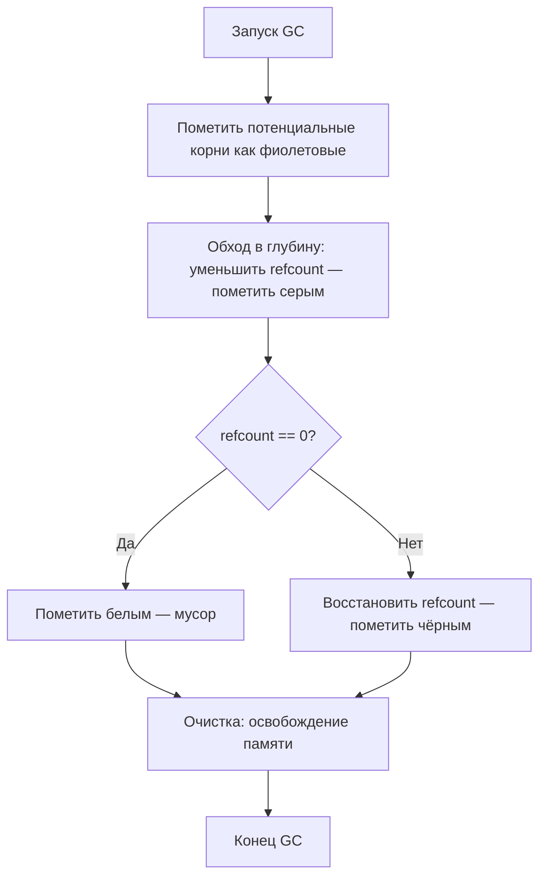

# Garabage Collector в PHP

PHP использует автоматическую систему управления памятью. Она основана на **подсчёте ссылок** (Reference Counting) для немедленного освобождения памяти и **сборщике циклов** (Cycle Collector) для обработки циклических ссылок.

## 1. Основы подсчёта ссылок

В PHP каждая переменная хранится в структуре под названием `zval`.

- **Простые типы (PHP 7+):** такие типы как `null`, `bool`, `int` и `float` хранятся непосредственно в `zval` и не используют подсчёт ссылок.
- **Сложные типы:** `string`, `array`, `object`, `resource` и `reference` используют счётчик ссылок (`refcount`).

### Как это работает:

- При создании переменной или её присваивании другой переменной `refcount` базовых данных увеличивается.
- Когда переменная выходит из области видимости или удаляется через `unset()`, `refcount` уменьшается.
- Если `refcount` достигает **нуля**, PHP немедленно освобождает память.

```php
$a = ["hello"]; // refcount = 1
$b = $a;        // refcount = 2
unset($a);      // refcount = 1
unset($b);      // refcount = 0 -> Память освобождена
```

---

## 2. Сбор циклов (циклические ссылки)

Подсчёт ссылок сам по себе не может обработать циклические ссылки, когда два или более объекта ссылаются друг на друга.

```php
$a = new stdClass();
$b = new stdClass();
$a->child = $b;
$b->parent = $a;

unset($a, $b);
```

В этом примере, даже после `unset()`, оба объекта по-прежнему имеют `refcount` равный 1, потому что ссылаются друг на друга. Без сборщика циклов это привело бы к утечке памяти.

### Алгоритм сбора циклов (Bacon-Rajan)

PHP использует конкурентный алгоритм сбора циклов, который запускается, когда «корневой буфер» потенциальных циклов достигает определённого лимита (по умолчанию: 10 000).

1. **Корневой буфер:** когда `refcount` уменьшается, но остаётся > 0, PHP подозревает цикл и добавляет `zval` в корневой буфер.
2. **Маркировка (серый):** сборщик мусора выполняет обход в глубину, начиная с корней, уменьшая `refcount` каждого найденного внутреннего `zval`.
3. **Сканирование (белый/чёрный):**
   - Если `refcount` `zval` теперь равен **0**, он помечается как **мусор (белый)**.
   - Если `refcount` **> 0**, он помечается как **достижимый (чёрный)**, и его `refcount` восстанавливается.
4. **Очистка:** все «белые» `zval` удаляются из памяти.

### Схема: сбор циклов GC



---

## 3. Влияние на производительность

### CPU vs Память

- **GC включён (по умолчанию):** предотвращает утечки памяти, но создаёт периодическую нагрузку на CPU при запуске цикла сборки.
- **GC выключен:** немного более быстрое выполнение (полезно для очень короткоживущих скриптов), но может привести к высокому потреблению памяти при наличии циклических ссылок.

### Ручное управление

Управлять сборщиком мусора можно с помощью следующих функций:

- `gc_enable()` / `gc_disable()`: включение и выключение сборщика.
- `gc_collect_cycles()`: ручной запуск цикла сборки.
- `gc_status()`: возвращает статистику текущего состояния GC.

### Оптимизации в современном PHP

- **PHP 7.3+:** значительно улучшена производительность сборщика циклов.
- **PHP 8.0+:** улучшена обработка внутренних структур.
- **PHP 8.3+:** добавлена возможность настройки максимального количества корней через `zend.gc_max_roots` и расширен вывод `gc_status()` (добавлены флаги `running`, `protected`, `full`).

### Лучшие практики

- Для **длительно работающих процессов** (демоны, воркеры) всегда оставляйте GC включённым.
- Избегайте создания глубоких циклических структур, если производительность критична.
- Используйте `gc_mem_caches()` (PHP 7+) для освобождения памяти, используемой менеджером памяти Zend Engine.

---

## Ссылки для дальнейшего изучения

- [Reference Counting Basics](https://www.php.net/manual/en/features.gc.refcounting-basics.php)
- [Collecting Cycles](https://www.php.net/manual/en/features.gc.collecting-cycles.php)
- [Performance Considerations](https://www.php.net/manual/en/features.gc.performance-considerations.php)
